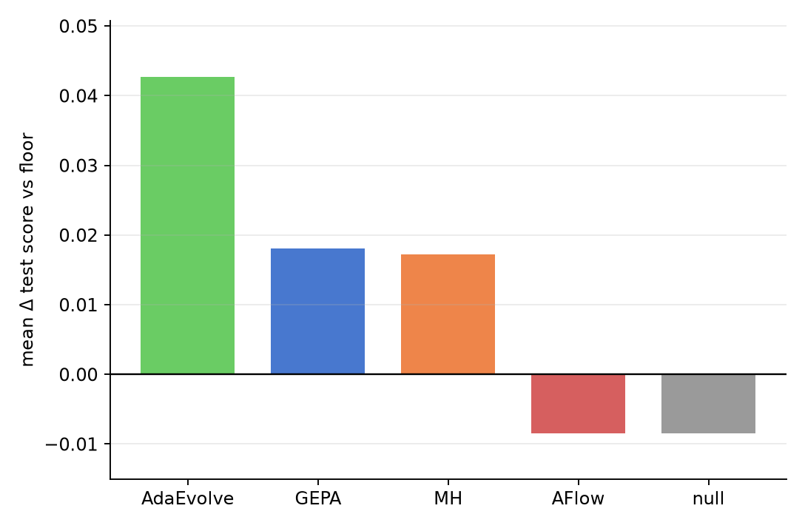
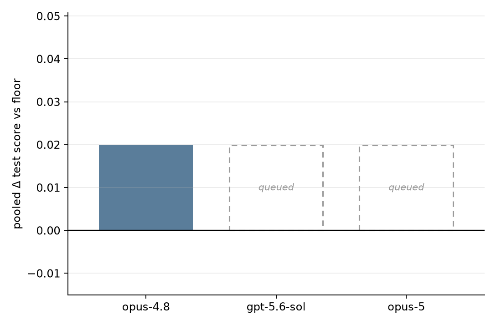

There are roughly two ways to make an agent better. You can improve the model —
pretraining, RL, post-training of every flavor — or you can improve the
*program* wrapped around it: the prompts, the workflow, the tools, the
scaffold. Call them parameter space and program space. Parameter space is where
the headline gains come from, but it is closed territory: a point of lift costs
a training run, and a handful of labs can pay. Program space is the opposite —
open to anyone, priced in tens of dollars, iterable in an afternoon — and the
same model routinely swings by double digits depending on the harness it runs
inside.<!-- TODO: pin a real number here — SWE-bench leaderboard spread for a
fixed model across scaffolds is the obvious citation -->

{#fig-two-axes width=88%}

Until recently, program space was searched by hand, which is to say barely:
harness design is a high-dimensional, gradient-free search problem, and humans
explore it by folklore. What changed is that frontier models became good enough
to do the searching — to read an agent's trajectory, diagnose the failure, and
propose an edit. A field has formed around this almost overnight: prompt
evolvers like GEPA [@gepa], workflow searchers like AFlow [@aflow], and the
recursive-self-improvement line — ADAS, the Darwin Gödel Machine — where the
agent rewrites its own scaffold. A new optimizer every few weeks. And if your
instinct is that the next model release makes all of this moot — note that the
argument cuts the other way. The optimizer is a model too. Every release
upgrades the thing that improves the agent, not just the agent.

It is not hard to see where this goes. If program-space search keeps
compounding with model capability, harness design stops being artisanal:
you don't hand-write a scaffold any more than you hand-tune weights — you pick
an optimizer, point it at your agent, and pay for the lift. Agent optimization
becomes a component you choose the way you choose Adam over SGD. For that
future to arrive, one question has to have a measurable answer: *which of these
methods actually works, on what, and at what cost?*

Right now it doesn't. Every optimizer paper grades its own homework: its own
tasks, its own seed agents, its own budget, its own base model — and, when
baselines appear at all, its own reimplementation of the competition. The
numbers never meet. A field that cannot compare its methods cannot tell whether
it is making progress.

So we built the comparison and ran it, and before describing the instrument,
here is the one result we most want you to take away. When a machine optimizes
an agent, it grades its progress on data it can see — and on that data,
improvement is nearly guaranteed. Across the forty-one runs in our grid that
used a frontier worker, the methods' own selected candidates claimed a mean
**+4.4 points** on GPQA-Diamond, **+8.8** on τ²-bench, **+4.1** on CharXiv.
Scored on a sealed test split the optimizer never touched, those same
candidates kept **−0.2**, **+1.9**, and **+1.5** — and on GPQA and τ², exactly
half the runs ended above the agent they started from at all. Nearly
everything the optimizer believes it gained is selection pressure on a small,
noisy dev split; the part that survives the seal sits at or barely above the
noise of re-scoring an *unchanged* agent. That gap — between the lift a method
reports and the lift that exists — is the finding this post is organized
around, and the reason its title says *evaluation*, not *benchmark*.

MABench is our attempt at the measuring stick. The fixed point of every
run is a **seed agent paired with a dataset**; the thing under test is an
**optimization method running on a model** — vendored verbatim, never
reimplemented — handed a copy of the seed, a metered budget, and nothing
else. The method may do anything to the agent: rewrite its prompt,
restructure its workflow, edit its source. The one rule that matters for
reading the results: the method **checkpoints** whatever it believes is
its best, and only those checkpoints get scored — later, on a **sealed**
test split the method never sees. It never grades itself. A run's result
is how far the sealed score moved over the seed's, and what that cost.

| Carrier | The task | Base | Medium | Advanced |
|---|---|---|---|---|
| **GPQA-Diamond** | one-shot graduate-science MCQ | CoT | Program-of-Thoughts · self-refine | multi-agent debate · Tree-of-Thoughts |
| **τ²-bench** | tool-use dialog against a simulated user | ReAct | plan-then-act · reflect/self-correct | ReWOO · memory-scratchpad |
| **CharXiv** | multimodal chart QA | direct VLM | crop-zoom re-query · K-sample self-consistency | PoT over the extracted table · draft→verify→revise |
| **Terminal-Bench-2** | terminal / coding tasks in containers | minimal command loop | plan · reflect · explore | Terminus |

: The grid. Each carrier ships one base seed and literature-pattern
variants arranged by scaffold complexity; each variant exposes a different
edit surface, so a method's lift has to generalize across agent shapes
rather than fit one. The seed floors are not flat — on GPQA alone the five
seeds span 0.58 to 0.69 — which is why every result is Δ over *its own*
seed, never over a pooled baseline. {#tbl-suite}

And the one taxonomy fact needed to read the results: methods differ on
the **surface** they edit — *context* (prompts, skills, memories) or
*program* (source, control flow, the workflow graph) — and on their
**coupling** to the agent. *Agnostic* methods (GEPA, Meta-Harness,
AdaEvolve) improve any seed you hand them; *exogenous* designers (ADAS,
AFlow) grow their own artifact from their own genesis; *endogenous*
methods (DGM, SICA) **are** the agent, rewriting itself. Coupling
determines what a fair comparison even is — an agnostic method can be
swept across seeds, an agent-native one can only be scored against the
same seed floor on its own carrier — and the protocol is built around
that distinction.

But this post is not a benchmark release, and we want to be precise about
why. Benchmarks are starting to appear in this space — Evo-Bench
[@evobench] for harness evolution, PAST-Bench [@pastbench] for experience
reuse in personal agents — and having now run our own instrument across
some eighty cells, four workers, and three meta-models, our most confident
conclusion is about the measurement itself: at today's effect sizes and
noise levels, no protocol we know of — ours included — can stably rank
optimization methods, let alone the models running them. The dev–test gap
we led with is one reason. The other two: the lifts that survive
the seal are typically smaller than the eval's own run-to-run noise, and
the gains that do clear the noise appear and disappear with worker
headroom. A leaderboard built on numbers like these would be ranking
luck.

So we are publishing this as what it turned out to be: an **evaluation and
analysis**. The rest of the post is the evidence — the noise floor every
claim has to clear, what survived the sealed split and what evaporated
there, why the strongest worker is the hardest to improve — and, closing,
what a benchmark of this kind would need before its rankings mean
anything.

## The noise floor

The first thing the instrument measures is its own error bar, because
this field is noisy in a way most benchmarks are not. The workers are
stochastic, the optimizer is stochastic, and even *scoring is* — re-score a
frozen, unchanged agent on the same sealed split and 20–40% of the items flip
their verdict between repetitions. We measured this directly by re-scoring
seed agents three times under identical conditions: the run-to-run standard
deviation of a single test score is **0.021**. That means the difference
between two single runs is noisy at sd ≈ 0.03, and a claimed lift needs to
reach **~0.06 — six points — to clear two sigma**. Many published
agent-optimization gains are smaller than that.

This is not a quirk of our setup; the field is converging on the same
diagnosis. Gupta et al. [@nouniversalharness] ran 30 budget-matched harness
variants across 12 model–problem pairs — over three million rollouts — and
concluded that discovery harnesses "are often compared using too few
independent trials to distinguish key methodological improvements from
run-to-run variance"; once trials are repeated and hypothesis-tested, no
fixed harness comes out reliably superior. HarnessOpt-Bench
[@harnessoptbench] shows the same thing right in its main table: every
optimizer configuration is run twice, and the two rounds routinely
disagree — across its 40 contestants the median round-to-round range is
0.07 normalized-gain units, the worst is 0.36 (the same configuration
scoring +0.23 one round and +0.59 the next), and for several the range
crosses zero, meaning the two rounds disagree on whether the optimizer
helped *at all*. Their reading matches ours: differences among
configurations "are often smaller than their round-to-round variation,
supporting tiers rather than a complete ranking." And when the
`optimize_anything` team put three optimizers under one matched budget
[@omni], the win column split 3–3–4 across ten tasks — even with noise
controlled, the winner flips task by task, so a comparison on one task and
one run supports almost nothing.

The only honest response is repetition. Every cell in our grid is run as
multiple independent repeats, and lifts are reported against the measured
floor, not against a single lucky run:

{#fig-noise width=88%}

When the budget runs out, the run is over. What survives is everything the
comparison needs and nothing the method can spin: the candidate graph, the
checkpointed curve, the ledger, the full trace — and a floor measurement that says
how big a lift has to be before it means anything. That is the protocol.
Here is what happened when we pointed it at real methods.

## First results: methods against the floor

The first slice of the grid is done: four optimizers plus the null floor,
run across the CharXiv, GPQA, and Terminal-Bench-2 cells of @tbl-suite —
worker `haiku-4.5`, meta-agent `opus-4.8`, a $150 ledger cap per run. The
core result is one number per method: mean Δ over the *measured* floor,
averaged settings-first so GPQA's three repeats don't outvote single-run
cells.

::: {#fig-first-slice layout-ncol=2}

{#fig-method-delta}

{#fig-model-axis}

Two axes of the grid after $150 of search per cell. **Left**, the method
axis: mean Δ over the measured floor — AdaEvolve **+0.043** · GEPA
**+0.018** · Meta-Harness **+0.017** · AFlow **−0.008**, identical, to
the third decimal, to what the untouched seed scored on its own re-run.
**Right**, the meta-model axis: every run in this slice used `opus-4.8`
as the meta-agent, so the axis has exactly one measured value (the pooled
Δ across all floored cells); the other tiers are filled in by the
worker-axis section below.
:::

Read this against the section above. AdaEvolve leads at +0.043, and its
best cell — +0.053 on GPQA — is the one lift in the slice that approaches
the two-sigma bar; its average also covers only the two cells it finished
(it crashed early on a third, which we excluded rather than score its
untouched seed as a method result). GEPA (+0.018) and Meta-Harness
(+0.017) sit clear of zero but inside the noise band: real-looking, not
yet claimable. AFlow's one finished cell lands at −0.008 — exactly what
the null floor scored on its own re-run. So the honest one-line summary
of the first slice: **one method produces a lift big enough to take
seriously, two produce lifts the noise could have produced, and one
produces nothing the seed didn't already have.**

Two caveats, stated rather than buried. The grid is unbalanced — some
cells are still running, some crashed, and both TB2 cells lack a measured
floor, so they contribute nothing to the
Δ average. And every number above is one $150 run (three on GPQA), so
this section will be re-cut as reps accumulate. What it already shows is
the shape of the field at this budget: gains exist, they are small, and
without the floor they would be indistinguishable from luck.

## Overfitting: dev vs. sealed test

The 28 sealed runs of the current slice — two meta models, 14 runs per
carrier, \$28–133 of search each — compress into one pair of bars per
split (@fig-devtest-bars). On dev, optimization essentially always
"works": every GPQA run and 11 of 14 τ² runs end above their genesis, for
a mean claimed lift of **+0.044** on GPQA and **+0.088** on τ². (The
three τ² exceptions are interrupted runs whose only checkpoint *is* the
genesis — searches that never claimed a lift, not ones that lost ground.)
On the sealed split the same selected candidates keep **−0.002** and
**+0.019** — both inside the noise floor measured above — and on each
benchmark exactly **half** the runs land above their genesis at all. After
tens of dollars of search per run, whether the product beats its own seed
on unseen items is a coin flip.

{#fig-devtest-bars width=100%}

The aggregate hides what the failure looks like from inside a single run.
@fig-devtest-case is one: `meta_harness` on τ²-bench, minimal seed, Opus
5 proposing. To the optimizer this run is a success — dev climbs from
0.582 to a selected best of **0.685**. We posthoc-scored every distinct
candidate the run produced on the sealed split, three reps each. The
sealed curve tells the opposite story: the *second* candidate was the
run's true peak (**0.564**, +0.019 over genesis), and every candidate
after it scored worse — down to **0.461** at the end, 0.084 *below* the
seed. The method wasn't merely failing to improve; it held its best
candidate at checkpoint 2 and spent the remaining ~\$60 of search
optimizing away from it, guided by a dev signal that kept rewarding the
walk.

{#fig-devtest-case width=88%}

### Where train, dev, and test come from

The splits are built to be IID: fixed near-equal
thirds (GPQA **65/67/66**, τ² **54/55/55**), committed as id lists, and
stratified so every split carries the identical domain mix — GPQA's
biology/chemistry/physics proportions, τ²'s airline/retail balance
(a flat shuffle had left GPQA's test physics-heavy). Selection on dev is
also score-only: a method may evaluate a candidate there as often as its
budget allows, but all it gets back is a single scalar — no per-item
verdicts, no transcripts, no gold. Only train exposes full feedback. Dev
and test are therefore the same measurement on different items, so any
dev→test gap is selection pressure on a finite, noisy dev split — not
leakage, and not distribution shift.

## The worker axis: headroom is the method's whole paycheck

Everything above ran one worker, `haiku-4.5`. Two further slices hold the
protocol fixed and move the worker — one down, one up — and together they
produce the sharpest and least comfortable finding of this evaluation.

**Down first.** On GPQA with `GPT-OSS-120B` as the worker (seed floor
≈ 0.65–0.70) and `opus-5` proposing, the instrument finally shows what
method separation looks like when it is real: Meta-Harness lifts
**+7.1 / +8.6 / +9.6pp** across three seeds (mean **+8.4pp**) while GEPA
manages **+0.0 / +2.0 / −5.6pp** (mean **−1.2pp**) — same worker, same
bench, same budget. The Meta-Harness lift clears the two-sigma bar in every
seed and reproduces across all three. So the protocol is not incapable of
detecting differences between methods; it detects them fine, *when they
exist*.

**Now up.** Two collaborator batches ran the same grid with
**`gpt-5.6-luna`** as the worker — one with `claude-opus-5` as the
meta-agent, one with `gpt-5.6-sol` — across GPQA, τ²-bench, and CharXiv,
roughly forty cells. On GPQA, where luna's untouched seeds already score
**0.83–0.90**, the mean sealed lift is **+0.9pp** under the opus-5 meta
and **−0.6pp** under sol — null under both, while the *dev* side was
reporting selected candidates as high as 0.92. On CharXiv (seed floors
0.69–0.73), the mean claimed dev lift of **+4.1pp** keeps **+1.5pp** after
the seal; one cell in thirteen clears two sigma; two end below their own
seed. τ² is where it gets interesting: it is the one carrier where the
frontier worker still has genuinely low floors — and exactly there, on the
weakest seed (floor ≈ 0.43), Meta-Harness posts **+8.5pp and +10.3pp**
under the two *different* metas: the only luna lifts to reach the bar, the
same method that wins the OSS-120B slice, replicated across optimizer
brains. Everywhere the frontier worker is already competent, nothing
survives the seal; where it is weak, the same harvesting works on it that
works on a weak model.

![The whole evaluation in one frame: sealed lift over the seed against
the seed's own floor, one point per cell, three workers. The shaded band
is ±2σ of eval noise for the 66-item carriers; τ²'s own floor is wider
(sd ≈ 0.03 per draw at n=55), so its points need roughly ±7pp to clear.
Lifts above the band live at low floors regardless of which worker or
meta produced them; the frontier worker's points hug zero wherever its
floor is already high. The two Terminal-Bench-2 diamonds at the far left
cut the other way: the lowest floors in the grid, and zero lift — both
runs handed back their seed unchanged. Headroom is necessary, not
sufficient.](figures/worker_axis.png){#fig-worker-axis width=94%}

Three structural observations make this hard to dismiss. First, the null
is **meta-independent**: swapping the optimizer's brain from
`claude-opus-5` to `gpt-5.6-sol` — different lab, different architecture —
moves the GPQA mean from +0.9pp to −0.6pp, i.e. not at all. And the one
real luna lift is meta-independent too: both metas found it, on the same
seed, with the same method. Whatever governs where lift is possible, it is
not the meta-model. Second, the noise floor replicates across the axis:
the same genesis digest, drawn three to four independent times in
different cells' posthoc scoring, gives run-to-run sd ≈ **0.010–0.017** on
CharXiv and **0.022–0.034** on τ² with a luna worker — bracketing the
0.021 measured with haiku on GPQA. The floor is a property of the
measurement, not of one cheap model. Third, the pattern is monotone in
headroom *within* a single worker, not just across workers: luna's τ²
seeds span floors from 0.43 to 0.56, and the sealed lifts fall from
+10.3pp to negative in near-lockstep as the floor rises.

Put the slices side by side and the field's headline numbers reorganize
themselves. Evo-Bench [@evobench] reports gains up to 16.6pp from
autonomous harness refinement — concentrated, on inspection, in settings
where the base harness is weak and the model underexploited, which is
exactly where our OSS-120B slice and our one luna hit live too. There is
no contradiction: **program-space search harvests headroom; it does not,
on current evidence, create capability.** The uncomfortable corollary is
about the future the introduction sketched. The optimizer-is-a-model-too
argument said every model release upgrades the thing doing the improving.
What this slice shows is that every release also *shrinks the thing being
harvested*: on the tasks where the frontier worker is already strong —
which are most tasks, and increasingly so — there is nothing left for
these methods to collect, and what remains harvestable concentrates in
the scaffold-heavy corners the worker is still bad at.

The caveats, stated in full because this is the spiciest claim in the
post. The luna batches are mid-flight snapshots, not sealed runs — their
summaries all read `running`, so every number is our posthoc re-scoring of
the genesis and the best *checkpointed* candidate (three reps, sealed
split), which measures "the best the method had checkpointed", not its final
selection. Three τ² cells had checkpointed nothing but their genesis and
contribute only floors. A provider-side API change (2026-08-08) means the
posthoc worker ran under slightly different decoding defaults than the
original searches; genesis and best were re-scored under *identical*
post-change conditions, so the lifts themselves are same-conditions
comparisons — what the drift breaks is any comparison against the runs'
own in-run records, and the possibility that a candidate tuned to the old
decoding under-shows today. And every luna cell is a single seed, so the
τ² Meta-Harness hit is two runs, not a distribution. None of these
caveats rescues the dev-side numbers, though: the 0.92 dev-best claims
are the runs' own records, and the gap between what a method believes and
what survives the seal is the one measurement every caveat leaves intact.

## The analyses to come

The grid is still filling in, so the rest of the results are written here
as protocol, not findings: for each question, what we measure, which
artifact it reads from, and what would count as an answer. None of it
needs new instrumentation — every analysis below runs off the record a
run already leaves behind (the candidate graph, the checkpointed curve, the
ledger, the sealed scores). The numbers land as the cells finish.

### Reading each method on its own terms

A single Δ per method compresses away the thing MABench actually records:
*how* the lift was produced. So each method gets a post-mortem built from
the same three artifacts — the candidate DAG (what it proposed, in what
order, descended from what), the ledger (where its $150 went: proposal
tokens vs. evaluation rollouts), and the anytime curve (when in the
budget the lift arrived). The strength/weakness read is the
cross-tabulation. A method that spends most of its budget evaluating one
deep chain is exploiting; one that fans out forty shallow candidates and
keeps none is exploring without memory; and the most instructive failures
are methods doing a competent search over the wrong surface.

Per method, the mechanism-specific question each trace should answer:

- **AdaEvolve** — it edits the agent's source, and it currently leads the
  slice. The question is *what kind* of edit is paying: control-flow
  changes, or prompt strings that happen to live in code? Diff every
  accepted candidate against its parent and classify the hunks. If the
  gains are mostly embedded-prompt edits, AdaEvolve is a prompt optimizer
  with a compiler's reach — worth knowing before crediting "code
  evolution."
- **GEPA** — reflective prompt evolution with Pareto-based selection. The
  check: does the Pareto frontier stay diverse or collapse into one
  lineage, and do successive reflections compound (each diff builds on
  the last) or oscillate (later generations undo earlier ones)?
- **Meta-Harness** — it rewrites the harness around a fixed agent. The
  check: which harness surfaces it actually touches across cells, and
  whether its +0.017 comes from one repeated trick or from
  carrier-specific adaptation.
- **AFlow** — MCTS over operator graphs. The check: how much of the
  operator vocabulary the search visits at this budget, and how deep the
  tree gets before the ledger runs out — a search designed for more
  budget than $150 should look visibly truncated, and that is a finding
  about cost-conditionality, not a defect.
- **HGM** — its only run is a TB2 cell with no measured floor, so it has
  a trace but no Δ. It joins this section when the TB2 floors are
  measured.

### Generalization Gap

Every run yields two lifts: Δdev — the method's chosen winner, scored on
the split it could see — and Δtest, the same candidate on the sealed
split it never saw. The gap between them is the single most
policy-relevant number in the benchmark: it is the size of the haircut
that "we improved the agent by X" takes when X was picked on the same
data used to search. @fig-selection-scatter plots it for the 28 sealed
runs. Not one run lands above the noise band around the
full-transfer diagonal; nine fall below it. The mean haircut is
**−0.058** — larger than any method's surviving lift — and it is not one
method's pathology: GEPA gives back 0.043 of its claimed lift,
Meta-Harness 0.075, AdaEvolve 0.047. The method that claimed the most
gave back the most. Because the seal is structural (the method's
interface simply never exposes test items), all of this is selection
pressure on a noisy dev split — not leakage.

{#fig-selection-scatter width=72%}

### Sensitivity to initialization

Three nested senses, cheapest first. *Run-to-run:* same seed, same
method, repeated — the gpqa-3seed repeats already measure this, and the
first question is whether a method's own spread exceeds the seed floor's
0.021; a method noisier than the thing it optimizes cannot be ranked from
single runs. *Seed strength:* same carrier, same method, three seed
levels — the base/medium/advanced columns of @tbl-suite exist precisely
for this. Does Δ shrink as the seed strengthens (headroom exhaustion), or
grow (stronger seeds give the optimizer more structure to work with)?
Each carrier row is a controlled comparison. *Convergence:* from
different seeds on one carrier, do a method's final candidates converge
on the same tricks — measured by diffing the final artifacts and by
behavioral agreement on shared items — or is the endpoint path-dependent?
If it converges, cheap seeds suffice and seed choice is a nuisance
parameter; if it doesn't, "the optimized agent" is an artifact of where
you started, and single-seed reporting is quiet cherry-picking.

### Failure analysis: what makes a run fail

A benchmark that reports only finished runs launders its denominator. So:
classify every *launched* run — finished-and-lifted, finished-flat,
crashed, budget-exhausted — and for each non-lift, read the meta-trace
backwards to the proximate cause. The taxonomy we expect, from the runs
so far: hard method crashes (AdaEvolve's CharXiv-medium run died $1.40
in, disclosed above); budget exhaustion mid-search with the best
candidate still unevaluated; degenerate proposals the method could not
back out of (candidates scoring below seed, then selected anyway);
and harness-fighting — malformed artifacts, contract violations, retry
loops that burn ledger without producing candidates. Failure rates get
reported next to Δ, per method: a +0.043 that crashes a third of the
time is a different proposition from a +0.017 that always lands, and the
field's habit of reporting only the first number is part of what MABench
exists to correct.

### Generalization: does an optimized candidate travel?

Take each cell's winning candidate and re-evaluate it — evaluation only,
no further search, a fraction of a run's cost — everywhere else it can
legally run. The taxonomy from earlier sections does real work here:
coupling class determines the shape of the matrix. Agent-agnostic
context candidates (a GEPA prompt) can be carried to other seeds on the
same carrier; endogenous code edits are welded to their agent and can
only travel across datasets, not seeds. So the cross-eval matrix is
triangular by construction, and the per-class transfer ratio —
Δ-elsewhere over Δ-at-home — is the statistic. A method whose lift
survives the trip has improved the agent; a method whose lift stays home
has fit the dataset, however impressive the home number.

### Browse the runs yourself

Every analysis above is auditable by hand, because every run's record is
browsable. The corpus ships with a read-only, build-free web visualizer:
a **Leaderboard** (the comparison board with matched cost→performance),
**Iterations** (best-so-far against budget — the anytime view),
**Pivot** (the method × condition fingerprint heatmap), **Runs** (one
run's anatomy: candidate graph, meta-trace, ledger), and an **Explorer**
(a single run's proposals, exact candidate ancestry, and the evidence
behind each accept). Every view carries its state in the URL — facets,
held conditions, even a specific seed-vs-candidate diff — so any figure
in this post can be linked as the interactive view it was cut from.
The live instance is at
[the run visualizer](http://127.0.0.1:8765/)<!-- TODO: local-only URL —
replace with the public deployment before sharing this post -->.

## What a reliable benchmark would take

We said at the top that this is not a benchmark release. Here is the
constructive version of that sentence. Every requirement below is
grounded in a failure we measured, not a hypothetical — and as far as we
can tell, no evaluation in this space (ours pre-dating this post
included, and the concurrent benchmarks [@evobench; @pastbench]) meets
more than a few of them.

1. **Report the noise floor as a first-class number.** Re-score an
   *unchanged* agent under the exact protocol, repeatedly, and print the
   sd next to every result table: ours is 0.021 (GPQA, haiku worker),
   0.010–0.017 (CharXiv, luna), and 0.022–0.034 (τ², luna — fewer test
   items, wider floor). Any effect inside ~2σ of that floor is a tier,
   not a rank. A headline gain reported without a floor
   — 16.6pp or otherwise — is not interpretable, because the reader
   cannot tell how many draws of pure noise it took to produce.

2. **Power the comparison before ranking it.** At sd ≈ 0.02 on a
   66-item test split, three scoring reps still leave per-cell standard
   errors of 0.01–0.02, while typical method effects are one to four
   points. The seeds-times-reps needed to resolve those effects at 2σ is
   a computable number; a benchmark should compute it and either pay it
   or report tiers. Our own grid, at current replication, resolves
   exactly one method separation (Meta-Harness on OSS-120B) — and we ran
   more repeats than is customary.

3. **Seal structurally, and resolve winners from the event record — not
   the run's say-so.** Test items must be unreachable through the
   method's interface, so overfitting the seal is impossible rather than
   discouraged. Just as important, and less obvious: the candidate a
   run's headline number refers to must be recovered from the evaluation
   events, not from the run's own summary. We found a bookkeeping
   off-by-one in checkpoint labeling that silently swapped which
   candidate a score was attributed to — the kind of bug that survives
   every plot and poisons a leaderboard invisibly. Attribution needs an
   audit path, which means the full event trace is a required artifact,
   not a nicety.

4. **Match and meter the budget, and report the curve.** A lift is a
   price, not a point: methods differ in where on the spend curve their
   gains arrive, and a fixed-budget snapshot reorders ranks as the
   budget moves — in an early thirteen-optimizer sweep of ours on
   BBH-hard, ranks kept reordering as the meter ran. Per-actor metering — optimizer
   thinking vs. worker rollouts — is what makes "at what cost" answerable
   at all.

5. **Stratify by headroom, because lift is a property of the pair.** The
   same method that separates cleanly on a weak worker (+8.4pp,
   reproducible) does nothing measurable to a frontier one on the tasks
   it is already strong at — and posts its two biggest lifts of the whole
   grid exactly where that frontier worker's floor is lowest
   (@fig-worker-axis). A pooled leaderboard number averages over the one
   variable that determines whether the method works at all. Report lift
   against seed floor, per worker tier; treat "does it still work at the
   frontier?" as a benchmark axis, not a footnote.

6. **Run validity controls like an adversary is coming.** A null-method
   arm (search that proposes nothing) to certify the floor — ours scored
   a lift of exactly zero, which is the only reason we trust the small
   positive lifts elsewhere. Jailed execution for methods that run
   LLM-authored code, because a benchmark whose harness can be
   reward-hacked measures compliance, not capability. And failure-rate
   reporting next to every Δ: a method that crashes a third of its runs
   has that fact laundered by a finished-runs-only table.

None of this is exotic; it is the ordinary machinery of measurement,
applied to a field that has been sprinting too fast to install it. Our
contribution, on reflection, is not a leaderboard — it is the instrument,
the ~80-cell corpus of fully-traced runs, the floor measurements, and the
two findings we believe survive every caveat in this post: **selection on
a noisy dev split takes back most of what optimization claims, and
current methods harvest headroom rather than create capability.** When a
benchmark in this space can meet the six requirements above, its rankings
will mean something. We intend MABench's next release to be judged
against exactly that list.

<!-- Sections still to draft, likely order:
     - Faithfulness (vendored verbatim; the tuning-effort confound, owned honestly)
     - Where this sits (NAS-Bench / HPOBench lineage)
     Results sections still pending (add under "First results" / "The analyses
     to come" as data accumulates):
     - The cost story (anytime curves; accuracy-per-dollar)
     - Batch B2 (OSS-20B) joins the worker-axis section when sealed (~08-14)
     - figures for the worker-axis section: lift-vs-seed-floor scatter by worker
     Parked from an earlier draft (may return as a protocol-details section):
     the disclosure ladder — endpoint table (run_train full facets / score_dev
     scalar, charged to budget / score_test sealed / spend free) + "a method
     cannot overfit what it never sees". In git history at bd539fc. -->
